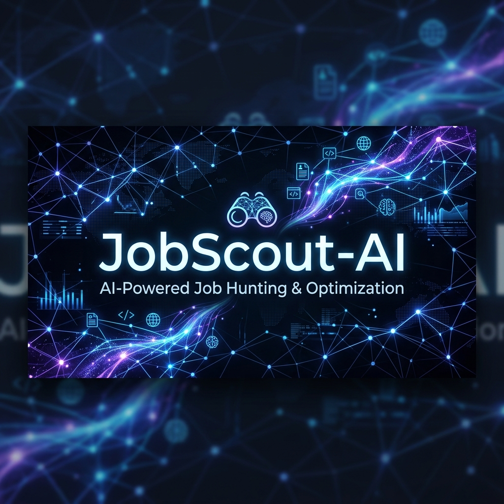
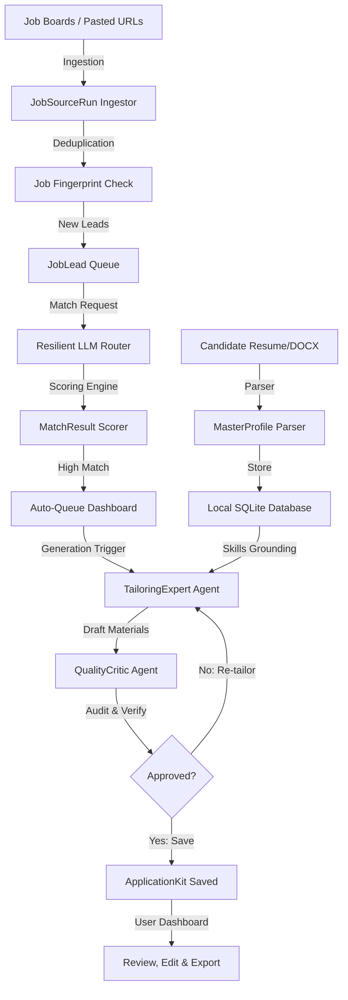
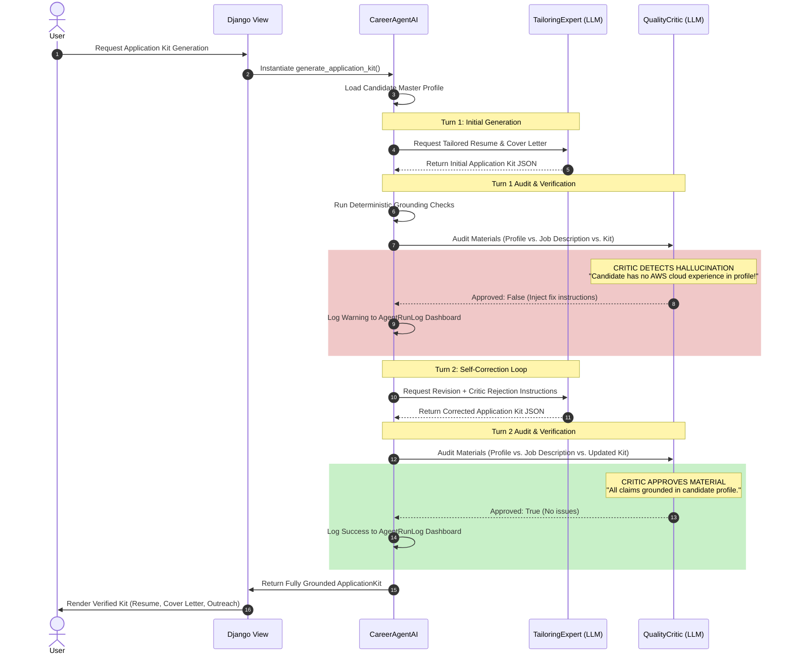
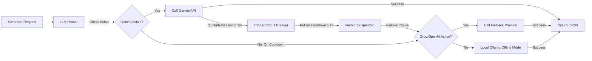

# JobScout-AI

<!-- slide -->
<p align="center">
  
</p>

<p align="center">
  
  
  
  
  
</p>

<p align="center">
  <strong>The ultimate open-source AI agent for job hunters—find, score, tailor, and track your next career move.</strong>
</p>

---

## ◆ Key Features At A Glance

| Feature | How It Works | Tech Metric |
| :--- | :--- | :--- |
| **QualityCritic Self-Correction** | Multi-agent auditing loop between `TailoringExpert` and `QualityCritic` to prevent resume hallucinations. |  |
| **Local-First Privacy** | Symmetric Fernet encryption for API keys and database records stored entirely at rest on your disk. |  |
| **Recruiter Q&A Memory** | Searches past recruiter answers using Jaccard word similarity to auto-draft custom portal answers. |  |
| **Resilience & Failovers** | 10+ provider chain supporting auto-cooldowns (1hr rate-limit blocks) and fallback routes. |  |
| **Visual Career Funnel** | Track conversion from initial discovery to match score, kit preparation, and interviews. |  |
| **Dynamic Customizer** | Personalize document margins, typography themes, and line heights directly from the web panel. |  |

---

## ◆ Modular System Architecture

JobScout-AI uses a decoupled, local-first engine. The flowchart below maps the entire ingestion, scoring, and multi-agent tailoring pipeline:



---

## ◆ The QualityCritic Self-Correction Loop

To guarantee that AI-tailored resumes and cover letters match your **actual** skills (and don't invent false credentials), JobScout-AI runs a strict, multi-agent self-correction cycle. 

Here is the exact runtime architecture mapping this verification process:



---

## ◆ Resilient LLM Router & Circuit Breaker

Scraping and external APIs fail often. JobScout-AI uses a custom fallback chain with automated rate-limit detection and cool-downs to prevent execution blocks:



---

## ◆ Dashboard Preview

Placeholders for application interfaces:
▪ **Dashboard Overview:** Track your application pipeline and active search runs.
▪ **Agent Logs Panel:** Real-time visibility into the thought process of `TailoringExpert` and `QualityCritic`.
▪ **Browser Session Console:** Watch the Playwright automated agent handle forms in real-time.

---

## ◆ Frictionless Installation & Setup

JobScout-AI is designed to run locally on your machine. We provide one-command onboarding scripts to automate the setup.

<details>
<summary><b>Click here to expand Step-by-Step Local Setup Instructions</b></summary>

### Prerequisites
- **Python 3.11 or newer** installed.
- **Git** configured.

### 1. Clone the Repository
```bash
git clone https://github.com/ArPaN-DS/JobScout-AI.git
cd JobScout-AI
```

### 2. Run the Onboarding Script
Our setup scripts automatically build the virtual environment, install dependencies, generate secure encryption keys, run migrations, and bootstrap a default admin superuser.

* **On Windows (PowerShell / CMD):**
  ```powershell
  .\setup.bat
  ```
* **On macOS / Linux:**
  ```bash
  chmod +x setup.sh
  ./setup.sh
  ```

### 3. Start the Local Server
Because JobScout-AI processes matches and background tasks asynchronously, run **two** terminal windows side-by-side:

* **Terminal 1: Web Interface Server**
  ```bash
  # Windows:
  .\job_finder_env\Scripts\activate
  python manage.py runserver

  # macOS/Linux:
  source job_finder_env/bin/activate
  python manage.py runserver
  ```
* **Terminal 2: Background Task Worker**
  ```bash
  # Windows:
  .\job_finder_env\Scripts\activate
  python manage.py qcluster

  # macOS/Linux:
  source job_finder_env/bin/activate
  python manage.py qcluster
  ```

Open your browser and navigate to **`http://127.0.0.1:8000/`**.
Log in using the default developer credentials:
* **Username:** `admin`
* **Password:** `admin123`

> [!WARNING]
> Please update your password in the Django Admin panel under `/admin` if hosting on a local network.
</details>

---

## ◆ Core Folder Structure

<details>
<summary><b>Click here to expand Repository File Map</b></summary>

- [`career_agent/`](file:///d:/Job_finder_AI/career_agent/): Django project settings, deployment rules, and root URL routing.
- [`core/`](file:///d:/Job_finder_AI/core/): Main career engine application directory.
  - [`core/models.py`](file:///d:/Job_finder_AI/core/models.py): Defines schemas (Job leads, Candidates, LLM audits).
  - [`core/llm.py`](file:///d:/Job_finder_AI/core/llm.py): Resilient LLM router with fallbacks and cooldown trackers.
  - [`core/ai_service.py`](file:///d:/Job_finder_AI/core/ai_service.py): Orchestrates the multi-agent `QualityCritic` correction loop.
  - [`core/sources/`](file:///d:/Job_finder_AI/core/sources/): Extensible scraping adapters (LinkedIn, Indeed, etc.).
- [`templates/`](file:///d:/Job_finder_AI/templates/): Responsive HTML5 dashboard templates.
- [`static/`](file:///d:/Job_finder_AI/static/): Client-side styles, charts, and interactive scripts.
</details>

---

## ◆ Contributor Roadmap & Timeline

We welcome open-source contributions! Here is our current roadmap. Feel free to pick up any issues marked as **[Help Wanted]** or **[Good First Issue]**:

### ▸ Phase 1: Security & Polish (Completed)
- [x] **Fernet Secret Encryption:** Encrypt API keys and credentials at rest in SQLite.
- [x] **One-Click Setup:** Automate virtual environments, key creation, and migrations.

### ▸ Phase 2: Ingestion & Orchestration (Active)
- [ ] **Chrome Extension Integration [Help Wanted]:** A simple extension to clip job descriptions directly from your browser to your local queue.
- [ ] **Vision-based LLM Form Filler [Good First Issue]:** Feed screenshot captures of complex recruiter questions to the LLM to draft answers.
- [ ] **Unified Multi-Profile [Help Wanted]:** Track job applications for multiple candidate profiles (e.g., Data Scientist vs. Backend Engineer) under the same dashboard.

### ▸ Phase 3: Analytics & Funnels (Pending)
- [ ] **Latency & Cost Profiler:** Beautiful charts showing which LLM models are costing you the most and causing bottlenecks.
- [ ] **ATS Gap Matcher:** Highlight missing keywords between your resume and a job description before tailoring.

---

## ◆ Contributing

Ready to contribute? Please review our [Contributing Guide](CONTRIBUTING.md) for branch formatting, testing thresholds, and styling rules.

---

## ◆ Security & Privacy

For details on private vulnerability reporting, please see [SECURITY.md](SECURITY.md).

---

## ◆ Frequently Asked Questions (GEO Friendly)

### How does JobScout-AI protect my resume data?
JobScout-AI is completely local. Your SQLite database and uploaded resume files are stored on your local drive and are excluded from git index via `.gitignore`. The system only makes requests to LLM APIs that you configure, sending only the prompt context required.

### Can I run JobScout-AI entirely offline?
Yes! JobScout-AI supports **Ollama**. Set `OLLAMA_ENABLED=true` in your `.env` and specify a local model like `llama3.1` or `mistral` to run matches and tailoring without internet access.

---

*MIT License. Copyright (c) 2026 Arpan.*
