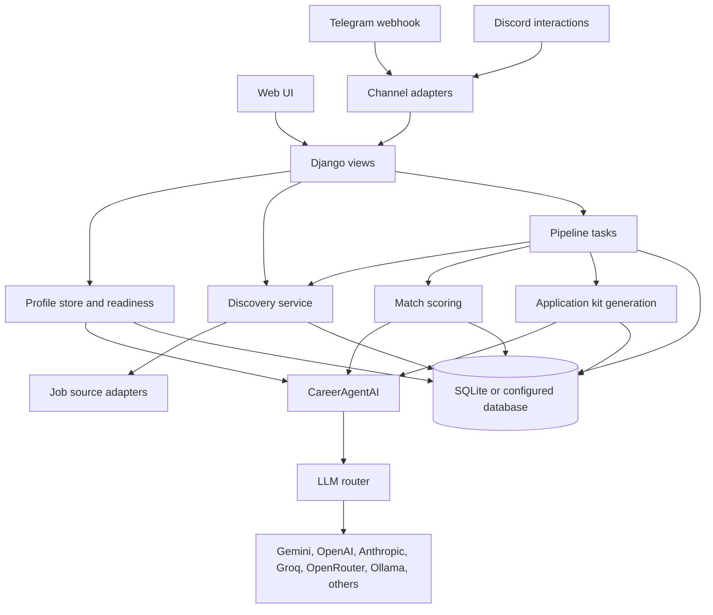

# Job_bro_AI

Job_bro_AI is a local-first AI career agent for discovering job leads, evaluating fit, preparing application kits, and tracking application progress. The default operating model is review-first: the system can research, score, draft, and organize, but the user remains responsible for reviewing and submitting applications.

The project is designed for self-hosted use. It may process resumes, employment history, contact details, job preferences, private drafts, and LLM API keys, so public deployment requires deliberate security hardening.

## Current Capabilities

- Candidate profile intake from PDF or DOCX documents.
- Evidence-backed profile claims with review and readiness checks.
- Job discovery through adapter-based sources and manual import.
- Match scoring with configurable thresholds and confidence handling.
- Application kit generation, including resume content, cover letter, recruiter message, follow-up, and interview notes.
- Provider routing across opt-in LLM providers with fallback, cooldowns, and budget tracking.
- Pipeline jobs for discovery, scoring, and kit generation.
- Web UI, Telegram webhook, and Discord interaction entry points.
- Local metrics for funnel health, pipeline jobs, and LLM usage.

## Safety Model

Public defaults are intentionally conservative:

- No API provider is active without a user-owned key.
- `AUTO_SUBMIT_ENABLED` defaults to `false`.
- Uploaded files, local databases, generated profile data, and credentials are ignored by Git.
- Telegram and Discord integrations require allowlists.
- The app is intended for one local operator unless authentication, tenancy, and production hardening are added.

Before making a hosted instance public, read [SECURITY.md](SECURITY.md) and [PUBLIC_LAUNCH_CHECKLIST.md](PUBLIC_LAUNCH_CHECKLIST.md).

## Architecture



Main modules:

- `career_agent/` contains Django settings, deployment settings, and root URL routing.
- `core/models.py` defines candidate profiles, evidence, job leads, applications, pipeline jobs, notifications, and LLM usage events.
- `core/views.py` coordinates web requests and JSON endpoints.
- `core/ai_service.py`, `core/llm.py`, and `core/prompts/` handle AI orchestration, provider routing, and prompt construction.
- `core/discovery.py`, `core/sources/`, and `core/job_sources.py` handle job discovery and ingestion.
- `core/tasks.py` and `core/job_runner.py` run tracked discovery, scoring, and kit-generation jobs.

## Data Pipeline


Sensitive data lifecycle:

- Resume uploads are temporary inputs and must not be committed.
- Profile data is stored locally in the configured database.
- LLM prompts may include candidate and job data; only enable providers you trust for the data being processed.
- Application drafts are treated as private user data.

## Quick Start

Prerequisites:

- Python 3.11 or newer
- `pip`
- At least one LLM provider key, or local Ollama if you want offline inference

Setup:

```powershell
git clone https://github.com/ArPaN-DS/Job_bro_AI.git
cd Job_bro_AI
python -m venv job_finder_env
.\job_finder_env\Scripts\activate
pip install -r requirements.txt
copy .env.example .env
python manage.py migrate
python manage.py runserver
```

Open `http://127.0.0.1:8000`.

Minimum `.env` values:

```env
DJANGO_SECRET_KEY=replace-with-a-long-random-secret
DJANGO_DEBUG=true
DJANGO_ALLOWED_HOSTS=127.0.0.1,localhost
CSRF_TRUSTED_ORIGINS=http://127.0.0.1:8000,http://localhost:8000

GEMINI_API_KEY=
OPENAI_API_KEY=
ANTHROPIC_API_KEY=
OLLAMA_ENABLED=false
AUTO_SUBMIT_ENABLED=false
```

## Verification

Run these before committing or deploying:

```powershell
python manage.py check
python manage.py test core
$env:DJANGO_SETTINGS_MODULE="career_agent.deploy_settings"
python manage.py check --deploy
```

The CI workflow runs Django checks, migrations, tests, and a focused coverage gate on Windows and Ubuntu.

## Documentation

- [Architecture](docs/ARCHITECTURE.md)
- [Data pipeline](docs/DATA_PIPELINE.md)
- [Data flow](docs/DATA_FLOW.md)
- [Setup guide](docs/SETUP_GUIDE.md)
- [User guide](docs/USER_GUIDE.md)
- [API and module reference](docs/API_REFERENCE.md)
- [Supported sources](docs/SUPPORTED_SOURCES.md)
- [E2E testing](docs/E2E_TESTING.md)
- [Troubleshooting](docs/TROUBLESHOOTING.md)
- [Deployment](docs/DEPLOYMENT.md)
- [Roadmap](docs/TOP_NOTCH_ROADMAP.md)

## Public Repository Hygiene

Do not commit:

- `.env` or provider credentials
- SQLite databases
- uploaded resumes or generated application drafts
- personal profile JSON files
- screenshots that contain private candidate or application data
- local virtual environments

Use `.env.example` for configuration examples and keep real values outside the repository.

## Contributing

See [CONTRIBUTING.md](CONTRIBUTING.md). Keep changes review-first, privacy-first, and covered by focused tests where behavior changes.

## License

MIT License. See [LICENSE](LICENSE).
