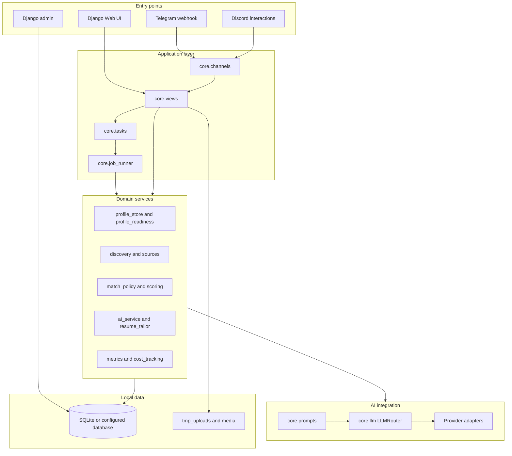
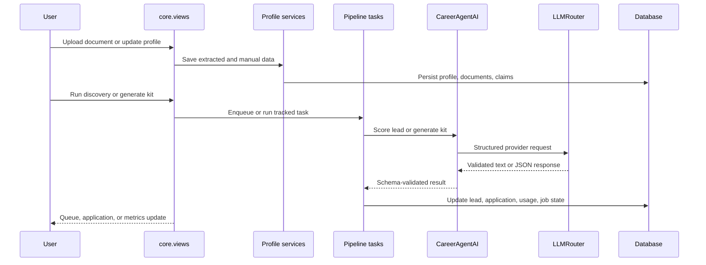

# System Architecture

Job_bro_AI is a Django application organized around a local-first, review-first workflow. The system keeps candidate data local by default, routes AI work through explicit provider adapters, and records pipeline state so discovery, scoring, and kit generation are observable.

## High-Level Architecture

## Core Responsibilities

| Area | Modules | Responsibility |
|---|---|---|
| Configuration | `career_agent/settings.py`, `career_agent/deploy_settings.py` | Runtime settings, public deploy checks, provider defaults, local storage paths. |
| Web workflow | `core/views.py`, `templates/`, `static/` | Onboarding, profile review, queue management, provider settings, metrics, and application review. |
| Candidate model | `core/models.py`, `core/profile_store.py`, `core/profile_readiness.py` | Candidate profile persistence, evidence claims, preferences, readiness gates, and profile snapshots. |
| Job pipeline | `core/discovery.py`, `core/sources/`, `core/job_sources.py`, `core/tasks.py` | Source adapters, lead normalization, dedupe, scoring, tracked jobs, and kit generation. |
| AI orchestration | `core/ai_service.py`, `core/llm.py`, `core/prompts/`, `core/schemas.py` | Prompt construction, structured outputs, provider fallback, validation, and schema grounding. |
| Reliability | `core/resilience.py`, `core/errors.py`, `core/job_runner.py`, `core/logging_utils.py` | User-safe errors, retries, cancellation, progress state, and structured logging. |
| Observability | `core/metrics.py`, `core/cost_tracking.py` | Funnel statistics, recent pipeline state, LLM usage, and budget checks. |

## Request Flow

## Design Principles

- Local-first: private candidate data, resumes, screenshots, and local databases are not repository assets.
- Review-first: the product prepares application material, but human review remains the public default.
- Provider isolation: API keys are opt-in and provider calls flow through a small adapter surface.
- Observable jobs: long-running work records status, progress, results, and failures through `PipelineJob`.
- Failure containment: user-facing errors are normalized, providers cool down on transient failures, and budget checks stop runaway usage.

## Extension Points

- Add a provider by implementing an adapter in `core/llm.py`, adding it to `_adapter_map`, and documenting the required environment variables.
- Add a job source by implementing `JobSourceAdapter` in `core/sources/` or wrapping a callable with `CallableSourceAdapter`.
- Add a workflow page by wiring a view in `core/views.py`, a route in `core/urls.py`, and a template under `templates/core/`.
- Add a tracked background action through `core/tasks.py` and wrap it with `run_tracked` from `core/job_runner.py`.

## Public Deployment Boundary

The repository is safe to publish only when credentials, databases, resumes, generated drafts, and local virtual environments are absent from Git. A public hosted instance needs additional authentication, per-user data isolation, HTTPS, secure cookies, and production settings.
