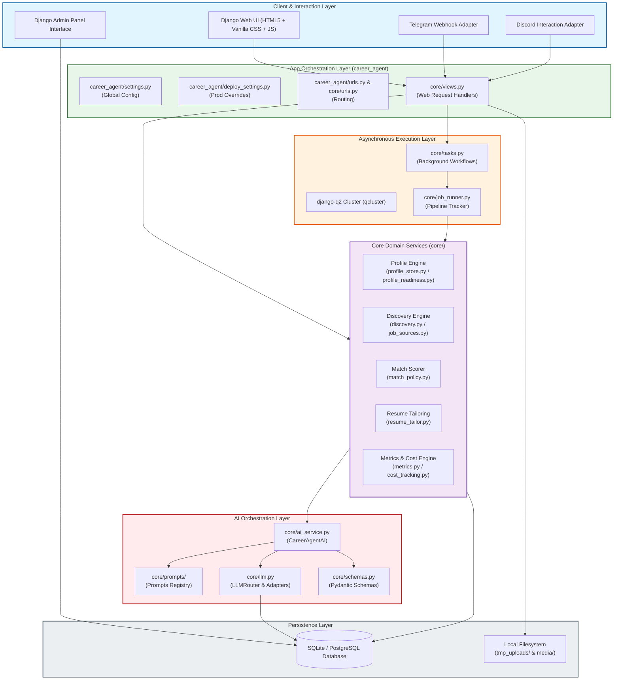
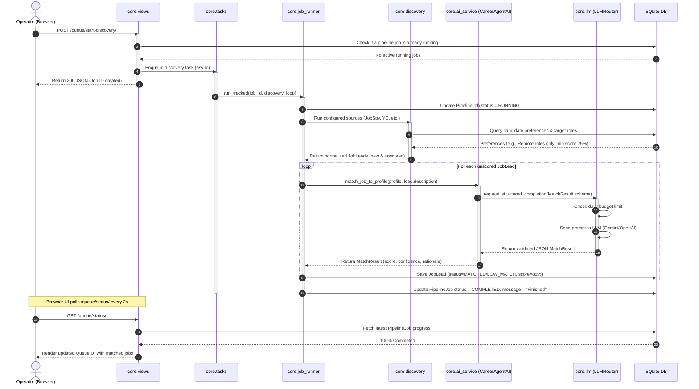

# Job_bro_AI System Architecture Manual

Welcome to the **Job_bro_AI** architecture manual. This document is written for senior developers, junior engineers, and freshers alike to understand the technical blueprint of the system. 

By the end of this guide, you will understand how data flows through the application, where key logic resides, and how to extend the platform safely.

---

## 1. Architectural Philosophy

Job_bro_AI operates under three strict design constraints:
1. **Local-First & Privacy-Centric**: Candidate profiles, uploaded resumes, and application trackers are stored locally (default: SQLite). They must never leak to third-party endpoints unless explicitly opted into via LLM provider keys.
2. **Review-First (Human-in-the-Loop)**: The AI does the heavy lifting of researching, match scoring, and drafting materials, but it does *not* automatically submit applications by default. The user remains the pilot.
3. **Resilience & Budget Guardrails**: LLM calls cost money and web portals rate-limit scripts. The system implements circuit breakers, backoff retries, and strict daily budget limits to prevent runaway API spend.

---

## 2. High-Level System Architecture

The application is structured as a standard Django monolithic application coupled with an asynchronous worker queue (`django-q2`). 



---

## 3. Directory Layout & Module Reference

Here is a breakdown of the codebase to help you locate components instantly:

```
Job_finder_AI/
│
├── career_agent/                   # Django Project Root Config
│   ├── __init__.py
│   ├── asgi.py                     # ASGI config for async servers (channels)
│   ├── settings.py                 # Core development configuration settings
│   ├── deploy_settings.py          # Production deployment-hardened settings
│   ├── urls.py                     # Root URL routing table
│   └── wsgi.py                     # WSGI config for sync servers
│
├── core/                           # Primary Application Directory
│   ├── fixtures/
│   │   └── golden_match.json       # Snapshot tests validation payload
│   ├── management/commands/       # Custom Django Management CLI Tools
│   │   ├── run_discovery.py        # Run job discovery adapters via CLI
│   │   ├── run_job_finder.py       # Main orchestration CLI runner
│   │   └── setup_discovery_schedule.py # Initialize background scheduler cron
│   ├── migrations/                 # Django Database Migration History
│   ├── prompts/                    # System Prompt Templates
│   │   ├── __init__.py             # Version registration
│   │   └── registry.py             # Prompt system templates (versions 1.0.0+)
│   ├── sources/                    # Third-party job feeds scrapers & APIs
│   │   ├── __init__.py
│   │   ├── base.py                 # Base class: JobSourceAdapter
│   │   └── registry.py             # Registry mapping adapters to IDs
│   ├── admin.py                    # Django Admin Console registration
│   ├── ai_service.py               # AI Business logic (CareerAgentAI class)
│   ├── apps.py                     # App metadata config
│   ├── auto_applier.py             # Logic for tailoring application kits
│   ├── channels.py                 # Telegram/Discord webhook router & handlers
│   ├── cost_tracking.py            # API token cost computation & daily limits
│   ├── discovery.py                # Main lead ingestion and dedupe scheduler
│   ├── errors.py                   # Custom error hierarchy & user-safe wrappers
│   ├── evidence_scanner.py         # Extracts facts/claims from candidate resume
│   ├── job_runner.py               # Runs and monitors long jobs (PipelineJob)
│   ├── job_sources.py              # Main source runner loop
│   ├── llm.py                      # Multi-provider routing, retry & circuit breaker
│   ├── logging_utils.py            # Structured logging configurator
│   ├── match_policy.py             # Re-scoring criteria & confidence check logic
│   ├── metrics.py                  # Ingestion, match, and application statistics
│   ├── models.py                   # DB models (CandidateProfile, JobLead, etc.)
│   ├── profile_readiness.py        # Profile readiness logic check blockers
│   ├── profile_store.py            # Profile update, parse, and backup store
│   ├── resilience.py               # Error classification, retry backoffs, circuit breakers
│   ├── resume_tailor.py            # Tailoring experience blocks to jobs
│   ├── schemas.py                  # Pydantic schemas validating API/LLM IO
│   ├── tasks.py                    # Background jobs executed by django-q2
│   ├── tests.py                    # Standard Unit Tests
│   ├── tests_discovery.py          # Job Discovery Integration Tests
│   ├── tests_phase3.py             # E2E flow tests with mocked LLM
│   ├── urls.py                     # Web App endpoint URLs
│   └── views.py                    # Django View functions (HTTP controllers)
│
├── templates/                      # UI Templates (HTML + Django template engine)
├── static/                         # Assets (CSS styles, JS files, and logos)
├── manage.py                       # Django CLI execution script
├── requirements.txt                # Python package dependency list
└── .gitignore                      # Git ignored files configuration
```

---

## 4. Architectural Patterns & Core Subsystems

### A. Provider Isolation & Fallback Router (`core/llm.py`)
To prevent lock-in to a single AI vendor, all LLM communication flows through the `LLMRouter`.
- **Adapters Pattern**: Individual adapters (e.g., `GeminiAdapter`, `OpenAIAdapter`, `AnthropicAdapter`) map standard payloads into vendor-specific API structures.
- **Provider Fallback**: If a provider fails (e.g., rate limits or service outage), the router automatically tries the next prioritized provider.
- **Circuit Breaker**: Found in `core/resilience.py`, it tracks consecutive failures. If a provider fails 5 times, it is placed on a cooldown period (default: 300s) to prevent spamming broken API channels.

### B. Background Queue (`core/tasks.py` + `django-q2`)
Long-running processes (like scraping 5 job sources or running a bulk AI scoring run of 100 leads) cannot execute during an HTTP request because it would timeout the user's browser.
- Long jobs are wrapped using `core/job_runner.py:run_tracked`.
- This creates a `PipelineJob` database record.
- Progress updates are written to the database (`progress_current`, `progress_total`, `status`), allowing the frontend UI (`static/js/queue.js`) to display real-time status bars via AJAX polling.

### C. Data Validation & Grounding (`core/schemas.py`)
All output received from LLMs is validated using Pydantic models (e.g., `MasterProfile`, `MatchResult`, `ApplicationKit`). 
- If an LLM returns malformed JSON, Pydantic raises a validation error, prompting the system to retry.
- **Grounded Verification**: The tailored output is checked against the candidate's original profile claims to prevent the LLM from fabricating experience (hallucinations).

---

## 5. Sequence Diagram: Core Request Lifecycle

This sequence diagram details what happens when a user clicks "Run Discovery" or "Generate Application Kit" in their browser:



---

## 6. How-To Guides: Codebase Extensions

### How to Add a New LLM Provider
To add a new LLM provider (e.g., Cohere, DeepSeek):
1. Open [core/llm.py](file:///d:/Job_finder_AI/core/llm.py).
2. Create a new adapter class inheriting from `LLMAdapter` (e.g., `class DeepSeekAdapter(LLMAdapter):`).
3. Implement `generate_text` and `generate_structured_output` inside your class.
4. Add the new adapter to the `_adapter_map` dictionary in `LLMRouter`:
   ```python
   _adapter_map = {
       "gemini": GeminiAdapter,
       "openai": OpenAIAdapter,
       "anthropic": AnthropicAdapter,
       "deepseek": DeepSeekAdapter, # New adapter
   }
   ```
5. Add the necessary API keys into `.env.example` and load them in `career_agent/settings.py`.

### How to Add a New Job Discovery Source
To add a new discovery source:
1. Create a new file under [core/sources/](file:///d:/Job_finder_AI/core/sources/) (e.g., `my_board.py`).
2. Implement a class inheriting from `JobSourceAdapter`:
   ```python
   from core.sources.base import JobSourceAdapter, RawJob

   class MyBoardAdapter(JobSourceAdapter):
       def fetch(self) -> list[RawJob]:
           # Write API fetch or scraping logic here
           return [RawJob(title="Software Engineer", company="ACME", ...)]
           
       def health(self) -> bool:
           # Check connection to the source
           return True
   ```
3. Register your class in [core/sources/registry.py](file:///d:/Job_finder_AI/core/sources/registry.py).

### How to Create a New Page / Endpoint
To add a new dashboard view:
1. Add a view function in [core/views.py](file:///d:/Job_finder_AI/core/views.py).
2. Register the URL route in [core/urls.py](file:///d:/Job_finder_AI/core/urls.py).
3. Create a corresponding template under `templates/core/`.
4. Ensure the view function is protected using `@login_required` or deployment controls if launched publicly.

---

## 7. Developer Onboarding Tips & Common Pitfalls

- **Python Caching**: Django Q-cluster runs in a separate terminal. If you modify your Django models or views, **always restart** the `python manage.py qcluster` terminal as well as the `python manage.py runserver` terminal. Otherwise, the workers will run cached, old versions of your code.
- **Database Locks**: SQLite is single-write only. Running multiple threads or high-concurrency background writing tasks may result in database lock errors. Keep background ingestion queues serialized.
- **Git Hygiene**: Run `git status` before you commit. Never let SQLite databases (`db.sqlite3`), environment configs (`.env`), or resumes (`tmp_uploads/`) slip through. Check `.gitignore` if you are unsure.
