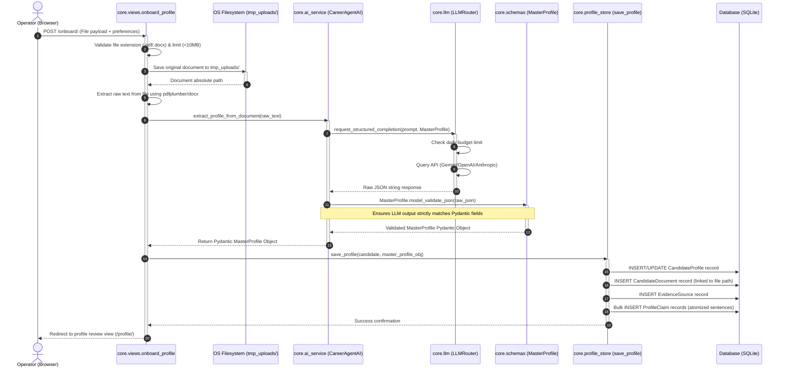
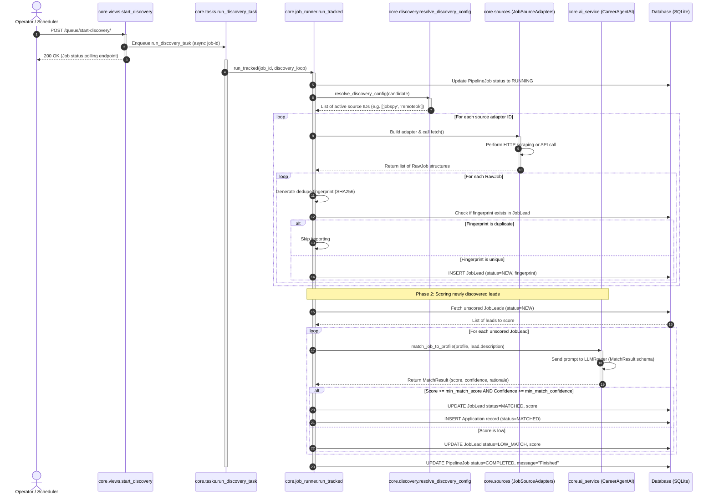
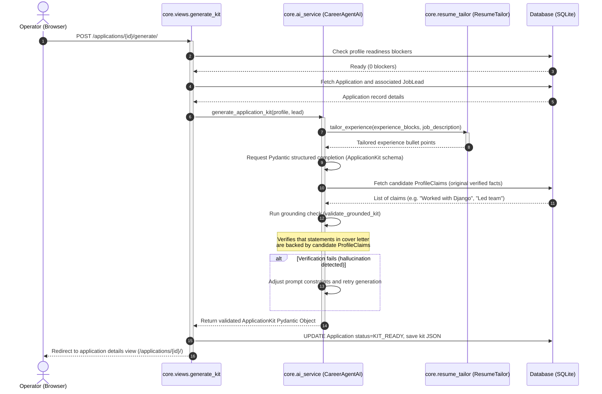
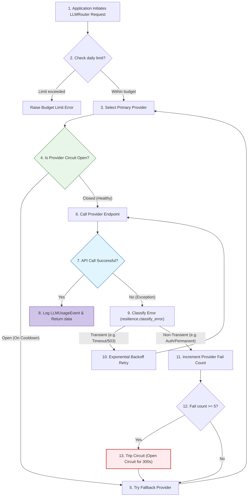
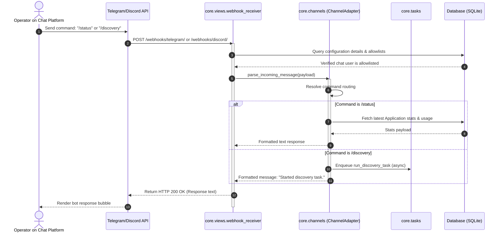
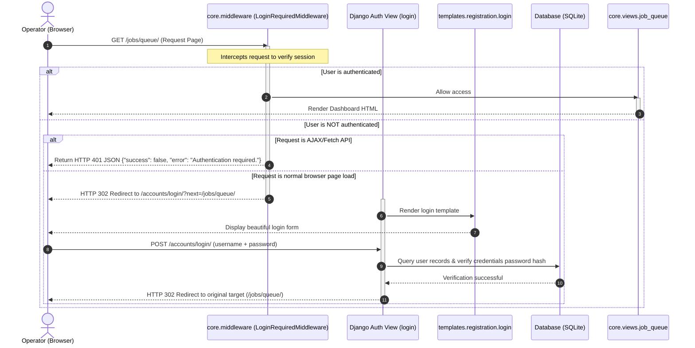
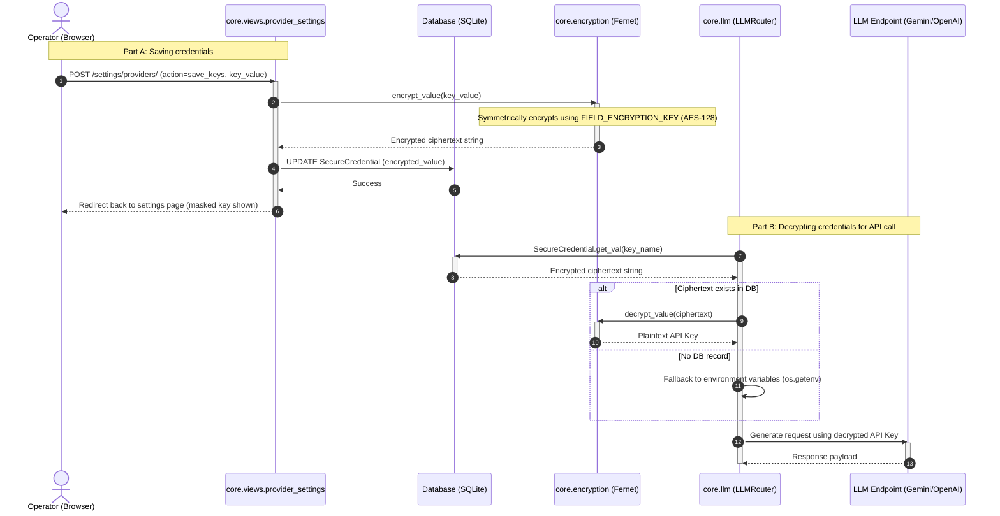

# Job_bro_AI Runtime Data Flow Diagrams

This manual details the step-by-step runtime sequence flows for **Job_bro_AI**. It maps the interactions between the browser client, Django views, background worker tasks, the AI service, and the external LLM endpoints.

---

## 1. Candidate Onboarding & Profile Extraction Flow

This flow triggers when a user uploads their resume to extract and compile a structured profile.

---

## 2. Job Discovery & Scoring Flow

This sequence executes when the background queue or CLI command checks for new job leads and runs AI matching.

---

## 3. Application Kit Tailoring & Grounding Verification

This flow builds targeted resume data and cover letters while verifying claims against the candidate's original resume to eliminate hallucinations.

---

## 4. Resilience & Circuit Breaker Logic

This detail diagram shows how the system handles external LLM API outages using backoffs, cooldowns, and fallbacks.

---

## 5. Channel webhook entrypoint flow (Telegram/Discord)

---

## 6. Secure Login & Session Authentication Flow

This flow maps the authentication enforcement gate for users accessing any dashboard view.

---

## 7. Secure Database Keys Encryption & Decryption Flow

This flow details how API keys are encrypted at rest and dynamically decrypted during LLM calls.

