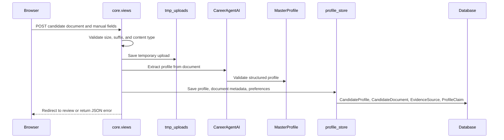
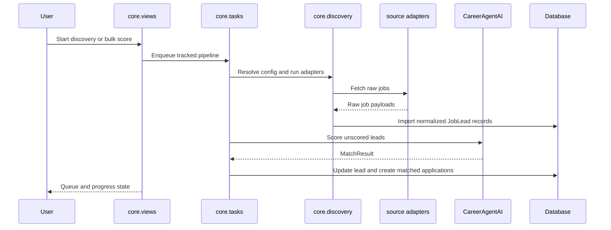
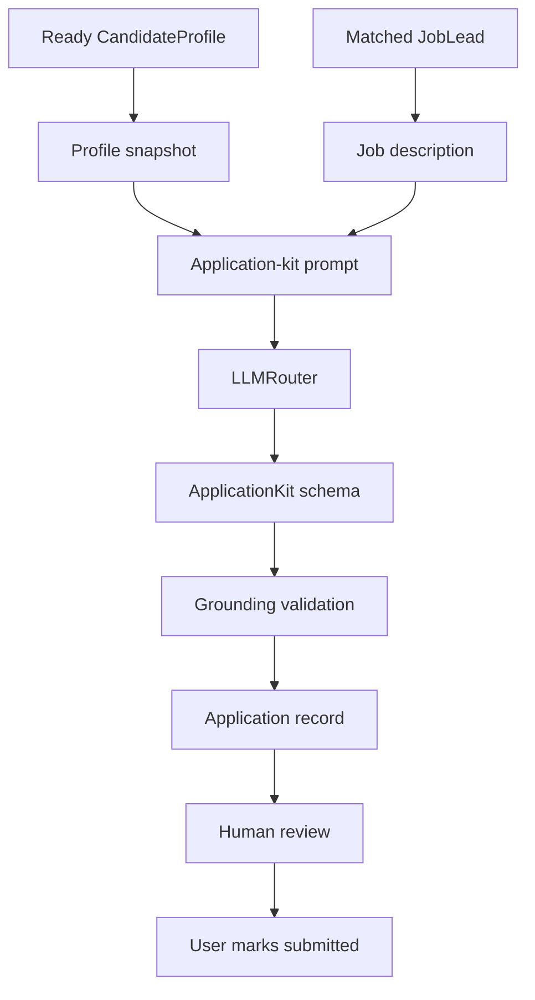
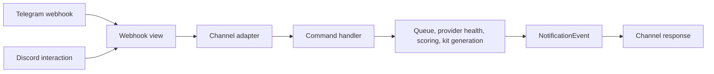
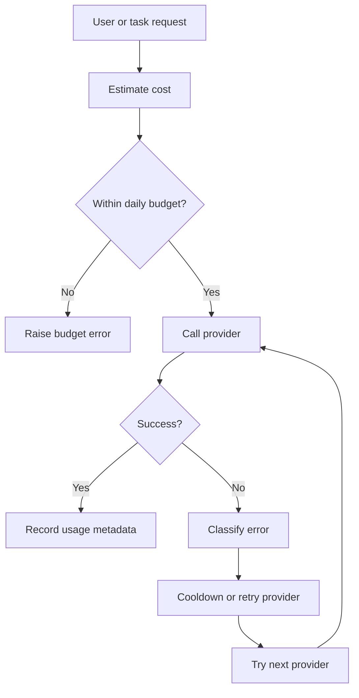

# Data Flow

This document gives the main runtime flows for the application. It is written for maintainers who need to understand where data enters, how it is transformed, and where it is persisted.

## Profile Extraction Flow

Failure handling:

- Invalid uploads return user-safe validation errors.
- Extraction failures are formatted through `core.errors`.
- Temporary files and uploads must remain outside Git.

## Discovery and Scoring Flow

Control points:

- `archive_stale_leads` keeps old queue items from growing without review.
- `assert_within_budget` protects against unexpected LLM spend.
- `thresholds_for_candidate` controls lead and application status transitions.

## Application Kit Flow

Persistence:

- `Application.profile_snapshot` preserves the candidate state used for generation.
- `Application.generated_kit` stores structured generated material.
- `Application.status` moves through matched, kit-ready, submitted, failed, or dismissed states.

## Channel Command Flow

Security controls:

- Channel users and destinations must be allowlisted.
- Secrets remain in environment variables.
- Channel payloads should not be committed or pasted into public issues.

## Error and Budget Flow

The UI should show actionable errors without leaking credentials, raw provider payloads, or private prompt contents.
