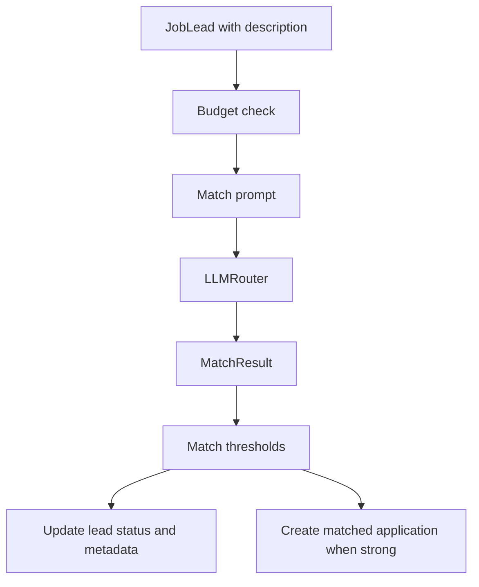

# Data Pipeline

This document describes how candidate data, job data, LLM outputs, and application artifacts move through Job_bro_AI. The pipeline is intentionally review-first: automation prepares material, and a human decides what to submit.

## Pipeline Diagram

```mermaid
flowchart LR
    A["Candidate inputs"] --> B["Document validation"]
    B --> C["Text extraction"]
    C --> D["LLM profile extraction"]
    D --> E["Schema validation"]
    E --> F["Evidence claims"]
    F --> G["Human review"]
    G --> H["Ready profile"]
    H --> I["Job discovery or manual import"]
    I --> J["Normalize and dedupe leads"]
    J --> K["Match scoring"]
    K --> L["Queue review"]
    L --> M["Application kit generation"]
    M --> N["Human submission"]
    N --> O["Outcome tracking and metrics"]
```

## Stage 1: Candidate Intake

Inputs:

- Resume or supporting document in PDF or DOCX format.
- Manual profile fields such as name, location, links, work authorization, and availability.
- Preferences such as target roles, locations, salary range, source selection, and match thresholds.

Processing:

- `core.views._validate_profile_upload` enforces file type and size.
- Uploaded files are written to `tmp_uploads/` for processing.
- `core.ai_service.extract_document_text` uses PDF or DOCX extraction helpers.
- `CareerAgentAI.extract_profile_from_document` requests structured profile extraction.
- `core.schemas.MasterProfile` validates and normalizes the result.

Persistence:

- `CandidateProfile` stores extracted and confirmed profile data.
- `CandidateDocument` records upload metadata and extraction status.
- `EvidenceSource` and `ProfileClaim` retain the evidence trail.
- `CandidatePreference` stores search and threshold preferences.

## Stage 2: Profile Readiness

The readiness gate prevents low-quality kit generation.

- `core.profile_readiness.assess_profile_readiness` checks whether required candidate information exists.
- `assert_ready_for_kit_generation` blocks bulk kit generation until the profile is ready.
- Claims can be confirmed or rejected before they are used in downstream prompts.

## Stage 3: Job Discovery

Inputs:

- Candidate preferences.
- Configured discovery source IDs.
- Manual job import payloads.

Processing:

- `core.discovery.resolve_discovery_config` combines global settings and candidate preferences.
- `core.sources.registry.build_adapters` selects source adapters.
- Adapters return raw jobs, which are normalized and imported as `JobLead` records.
- Fingerprints reduce duplicate leads.
- Source runs are recorded for operational visibility.

## Stage 4: Match Scoring

Important records:

- `JobLead.match_score`, `confidence`, `status`, and `ai_metadata`.
- `Application.match_score`, `match_confidence`, `profile_snapshot`, and `ai_metadata`.
- `LLMUsageEvent` when usage metadata is available.

## Stage 5: Kit Generation

The kit generation path combines the ready profile and selected job description.

- `get_matched_leads_for_kits` selects eligible leads.
- `CareerAgentAI.generate_application_kit` builds a structured kit.
- `core.schemas.ApplicationKit` validates the generated payload.
- `validate_grounded_kit` checks that generated material is grounded in the profile.
- `Application.record_kit` persists the kit and marks it ready for review.

Generated content may include:

- Tailored resume structure.
- Cover letter.
- Recruiter outreach.
- Follow-up message.
- Interview notes.
- Evidence notes.

## Stage 6: Tracking and Metrics

Operational state is captured in:

- `PipelineJob` for task status, progress, result, and errors.
- `JobSourceRun` for per-source discovery health.
- `NotificationEvent` for channel delivery attempts.
- `LLMUsageEvent` for provider, task type, token metadata, and estimated spend.
- `core.metrics.funnel_stats` for recent conversion and queue health.

## Data Protection Rules

- Do not commit uploaded documents, generated private drafts, SQLite databases, screenshots with private data, or profile JSON exports.
- Do not enable providers unless the user accepts the data-sharing boundary for that provider.
- Do not enable submission automation as a public default.
- Treat prompts and outputs as sensitive because they can contain candidate and job-application data.
