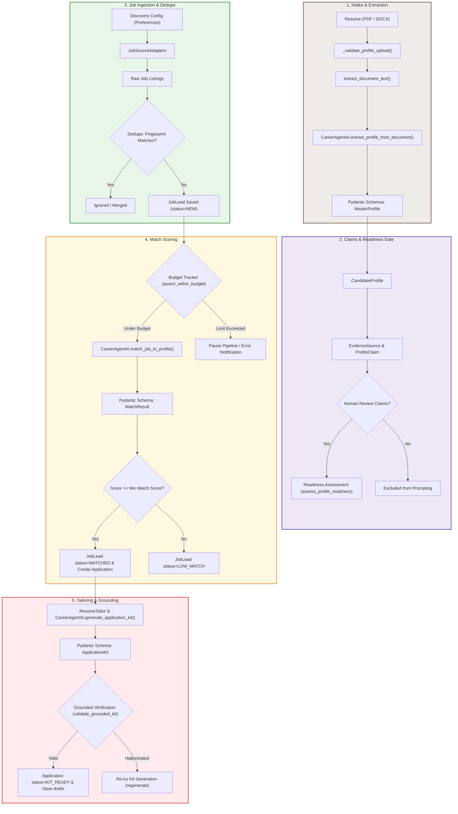

# Job_bro_AI Data Pipeline Reference

This document provides a deep dive into how data is ingested, processed, validated, scored, and tailored within **Job_bro_AI**. It maps the stages of the pipeline to the concrete Python code, databases, and schemas that execute them.

---

## 1. High-Level Data Pipeline Flow

---

## 2. Stage-by-Stage Breakdown

### Stage 1: Candidate Intake & Extraction
1. **Document Validation**: Files uploaded via the dashboard undergo file validation (size constraints, mime-type verification, `.pdf` or `.docx` extensions) in `core.views._validate_profile_upload`.
2. **Text Parsing**: Valid documents are saved temporarily to `tmp_uploads/` and read by `core.ai_service.extract_document_text`, which leverages helpers from `pdfplumber` (for PDFs) or `python-docx` (for Word files).
3. **Structured Entity Extraction**: The raw text is passed to `CareerAgentAI.extract_profile_from_document`. An LLM is queried using structured completions to output a strict JSON payload matching the `core.schemas.MasterProfile` schema.
4. **Parsing Schemas (`core.schemas.MasterProfile`)**:
   - `PersonalInfo`: Contact data, links, locations.
   - `ExperienceBlock`: Company name, role, date ranges, and list of bulleted achievements.
   - `EducationBlock`: Degree, institution, year.
   - `SkillItem`: Name, experience years, proficiency level.

---

### Stage 2: Claims & Profile Readiness
1. **Evidence Mapping**: Extracted profile elements are written to the database under three models:
   - `CandidateProfile`: Main registry containing parsed information.
   - `EvidenceSource`: Keeps track of the file name and date the information came from.
   - `ProfileClaim`: Individual statements of facts (e.g., "Worked with React for 3 years at ACME").
2. **Readiness Evaluation**: The `core.profile_readiness.assess_profile_readiness` module verifies that:
   - Basic contact info exists.
   - At least 3 experience blocks are present.
   - Core preferences are configured (target roles, locations).
   - *blockers* list is empty. If there are blocker messages, the app denies bulk application kit generation until they are resolved by the user.

---

### Stage 3: Job Ingestion & Deduplication
1. **Discovery Loop**: The `run_discovery` background task fetches jobs from configured adapters (such as `JobSpy`, `RemoteOK`, `Greenhouse`, `Lever`, or manual copy-pasting).
2. **Deduplication Fingerprinting**: To avoid processing duplicate postings across different sites:
   - A unique fingerprint is calculated for every job: `SHA256(company + title + location + cleaned_description)`.
   - If the fingerprint already exists in the database `JobLead` table, the job is discarded.
   - Cleaned descriptions normalize white spaces, punctuation, and character casings to ensure fingerprint stability.

---

### Stage 4: Match Scoring & Budget Guardrails
1. **Budget Check**: Before any LLM call, `core.cost_tracking.assert_within_budget` computes the running cost of the previous 24 hours of LLM events. If the daily budget limit is reached, it raises a budget error and stops the task.
2. **Provider Key & Priority Verification**: The `LLMRouter` queries the database for enabled `ProviderConfig` options, ordering them by priority score. Any provider with a credit status of `EXHAUSTED` (within its 1-hour cooldown window) is automatically bypassed.
3. **Scoring Prompt**: The candidate profile and job description are formatted into a matching prompt (`core/prompts/registry.py`) and sent to `CareerAgentAI.match_job_to_profile`.
4. **Pydantic Validation (`MatchResult`)**:
   - `match_score`: An integer rating from `0` to `100`.
   - `confidence`: Rating from `0.0` to `1.0`.
   - `fit_rationale`: Brief sentence detailing why they fit.
   - `missing_critical_skills`: List of missing requirements.
5. **Routing & Promotion**:
   - If `match_score >= CandidatePreference.min_match_score` AND `confidence >= CandidatePreference.min_match_confidence`, the `JobLead` status changes to `MATCHED` and an `Application` entry is created.
   - The `JobLead` and `Application` are associated with the specific `CandidateProfile` that initiated the run, enabling multi-profile partitioning.
   - Otherwise, the status becomes `LOW_MATCH` and is archived to keep the active queue clean.

---

### Stage 5: Tailoring & Grounding Verification
1. **Resume Styling Application**: The tailoring process queries the profile preferences to retrieve customize margins, font sizes, line heights, and layout themes (e.g., `modern_sans`, `classic_serif`).
2. **Tailored Generation**: For every `MATCHED` application, the `ResumeTailor` (`core/resume_tailor.py`) matches the candidate's actual skills and achievements against the job description to output custom experience highlights.
3. **Application Kit Generation**: The LLM compiles the complete kit (`core.schemas.ApplicationKit`):
   - Tailored Resume structure.
   - Targeted Cover Letter.
   - Direct Recruiter Message.
   - Follow-up schedule suggestions.
4. **Grounding Check (Anti-Hallucination Guard)**:
   - Generative models can accidentally invent achievements to match a job.
   - `core.schemas.validate_grounded_kit` compares every bullet point in the generated cover letter and tailored experience blocks against the candidate's verified `ProfileClaim` records.
   - If a sentence contains claims not found in the original resume (e.g., claiming to have led a 10-person Kubernetes team when the profile states only junior developer duties), the grounding validation flags the kit as invalid and initiates a regeneration attempt.

---

## 3. Database Entity Map

Here is the list of Django models (`core/models.py`) and how they support the pipeline:

| Database Model | Phase / Role | Description |
|---|---|---|
| `CandidateProfile` | Stage 1 (Intake) | Persisted master profile of the applicant (name, contact, parsed resume blocks). |
| `CandidateDocument` | Stage 1 (Intake) | Tracks uploaded PDF/DOCX files, original filenames, and extraction statuses. |
| `EvidenceSource` | Stage 2 (Readiness) | References where claims originated (e.g., "Resume_v2.pdf" or "Manual input"). |
| `ProfileClaim` | Stage 2 (Readiness) | Verified atomized assertions of experience and skill used for AI grounding checks. |
| `CandidatePreference` | Stage 3 (Discovery) | Configurations such as minimum scores, target jobs, locations, and active sources. |
| `JobLead` | Stage 3 & 4 (Scoring) | Normalizes ingested job opportunities. Holds descriptions, score, and ingestion details. |
| `Application` | Stage 5 (Tailoring) | The review card of a matched job. Holds the generated cover letter, tailored resume, and review logs. |
| `PipelineJob` | Monitoring / Admin | Tracks background task status (`running`, `completed`, `failed`), progress metrics, and errors. |
| `LLMUsageEvent` | Cost Control | Records provider name, model, prompt tokens, completion tokens, cost, and timestamp. |
| `JobSourceRun` | Monitoring / Admin | Ingestion logs monitoring rate limits, successes, and errors per source site. |
| `SecureCredential` | Security / API Config | Stores symmetrically encrypted AI API credentials (e.g. GEMINI_API_KEY) using Fernet. |

